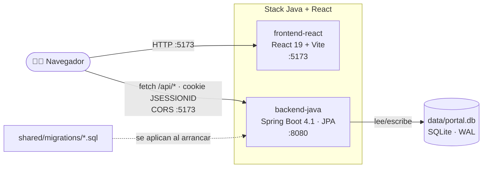
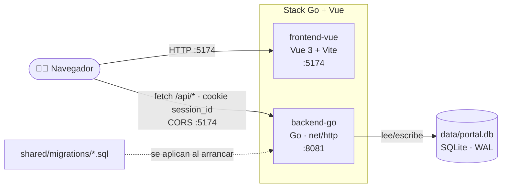
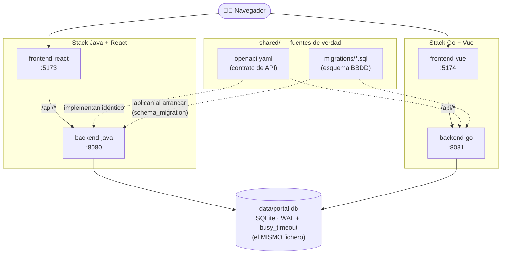

# Portal de Empleado (100% local)

Portal de empleado sencillo con **login simulado** y **perfil editable**,
construido para funcionar por completo en local. La gracia del proyecto es que
hay **dos backends** (Java y Go) y **dos frontends** (React y Vue) que hablan el
**mismo contrato de API** y comparten la **misma base de datos SQLite**, de modo
que cualquier frontend puede funcionar contra cualquier backend.

> **Estado actual**
>
> | Componente | Estado |
> |---|---|
> | `shared/openapi.yaml` (contrato) | ✅ Listo |
> | `backend-java` (Spring Boot 4.1.0 / Java 25) | ✅ Listo |
> | `backend-go` (Go + SQLite puro) | ✅ Listo |
> | `frontend-react` (React 19.2 + Vite 8) | ✅ Listo |
> | `frontend-vue` (Vue 3 + Vite 8) | ✅ Listo |
> | `docker-compose.*` | ✅ Listos |
> | `Makefile` | ✅ Listo |

## Estructura

```
.
├── backend-java/                   Spring Boot 4.1.0 (Java 25) + Dockerfile   → 8080
├── backend-go/                     Go + Dockerfile                            → 8081
├── frontend-react/                 React 19.2 + Vite 8 + Dockerfile           → 5173
├── frontend-vue/                   Vue 3 + Vite 8 + Dockerfile                → 5174
├── shared/openapi.yaml             Contrato de API común a ambos backends
├── shared/migrations/              Migraciones SQL del esquema (común a ambos)
├── data/portal.db                  SQLite compartido (se genera al arrancar)
├── scripts/contract-test.mjs       Tests de contrato (make verify)
├── docker-compose.java-react.yml   Stack backend-java + frontend-react
├── docker-compose.go-vue.yml       Stack backend-go + frontend-vue
├── Makefile                        Atajos de instalación, dev, verify y docker
└── AGENTS.md / CLAUDE.md           Guía para agentes de IA (receta de features)
```

## Arquitectura

### Stack Java + React (`docker-compose.java-react.yml`)



### Stack Go + Vue (`docker-compose.go-vue.yml`)



### Conjunto: los dos stacks a la vez

Los dos composes son independientes pero comparten las fuentes de verdad: el
contrato OpenAPI (misma API en ambos backends), las migraciones (mismo
esquema) y el propio fichero SQLite (mismos datos). Por eso cualquier
frontend puede hablar con cualquier backend, y un cambio hecho desde React/Java
se ve al instante en Vue/Go.



## Contrato de API

Un único [`shared/openapi.yaml`](shared/openapi.yaml) define las cuatro rutas
que **ambos backends implementan de forma idéntica** (mismo JSON):

| Método | Ruta          | Descripción                              |
|--------|---------------|------------------------------------------|
| POST   | `/api/login`  | Login simulado. Abre sesión (cookie).    |
| GET    | `/api/me`     | Perfil del empleado (401 si no hay sesión). |
| PUT    | `/api/me`     | Actualiza el perfil.                     |
| POST   | `/api/logout` | Cierra la sesión.                        |
| GET    | `/api/certificaciones`      | Lista los conocimientos / certificaciones. |
| POST   | `/api/certificaciones`      | Crea una certificación.        |
| PUT    | `/api/certificaciones/{id}` | Actualiza una certificación.   |
| DELETE | `/api/certificaciones/{id}` | Elimina una certificación.     |

Java y Go implementan cada uno el mismo contrato en su lenguaje; **no se
comparte código entre ellos, solo el contrato**.

### Login simulado

- El único empleado sembrado (`id=1`) tiene el username **`admin`**.
- Se entra si el `username` coincide; **cualquier contraseña es válida**.
- La sesión se mantiene con una cookie: `JSESSIONID` en Java, `session_id` en Go.
- El frontend debe hacer las peticiones con `credentials: 'include'`.

### Perfil del empleado (7 campos)

`nombre`, `email`, `telefono`, `puesto`, `departamento`, `direccion`, `foto`.

## Base de datos

Un único fichero SQLite en [`data/portal.db`](data), **compartido** por ambos
backends, en modo **WAL** con `busy_timeout` para que los dos procesos puedan
escribir a la vez sin errores `database is locked`.

El esquema lo definen las migraciones de
[`shared/migrations/`](shared/migrations): ficheros `NNN_descripcion.sql` que
**ambos backends aplican al arrancar** (la tabla `schema_migration` registra
cuáles corrieron ya, así el primero que arranca las aplica y el otro las
reconoce). Hibernate está en `ddl-auto=none` — ni Java ni Go crean esquema por
su cuenta. Para cambiar el esquema: añade una migración nueva, nunca edites una
aplicada. La siembra de datos demo (empleado + certificaciones) sigue en el
código de cada backend y es idéntica en los dos. El fichero de BBDD se crea
solo al arrancar (está en `.gitignore`).

## Puesta en marcha

Requisitos según lo que quieras arrancar: **Java 25 + Maven**, **Go 1.24+**,
**Node 22+**, y/o **Docker**. Hay un `Makefile` con atajos — `make help` los lista.

### En local (sin Docker)

```bash
make run-java     # backend Java   en http://localhost:8080
make run-go       # backend Go     en http://localhost:8081
make run-react    # frontend React en http://localhost:5173 (contra el Java)
make run-vue      # frontend Vue   en http://localhost:5174 (contra el Go)
# o los 4 a la vez:
make dev
```

### Con Docker

Los dos compose son **independientes** y montan el **mismo `./data`**, así que
puedes levantar uno, otro, o los dos a la vez (comandos por separado):

```bash
make up-java-react     # backend Java (8080) + frontend React (5173)
make up-go-vue         # backend Go   (8081) + frontend Vue   (5174)

make down-java-react   # parar
make down-go-vue
```

### Probar la API

```bash
# Login (guarda la cookie de sesión)
curl -c cookies.txt -X POST http://localhost:8080/api/login \
  -H 'Content-Type: application/json' \
  -d '{"username":"admin","password":"lo-que-sea"}'

# Perfil
curl -b cookies.txt http://localhost:8080/api/me

# Actualizar perfil
curl -b cookies.txt -X PUT http://localhost:8080/api/me \
  -H 'Content-Type: application/json' \
  -d '{"puesto":"Tech Lead","telefono":"+34 611 000 999"}'

# Logout
curl -b cookies.txt -X POST http://localhost:8080/api/logout
```

Cambia el puerto a `8081` para probar exactamente lo mismo contra el backend Go.

### Tests de contrato

Con el/los backend(s) arrancados, `scripts/contract-test.mjs` ejecuta la misma
batería de comprobaciones del contrato contra cada uno (login, perfil,
CRUD de certificaciones, códigos de error) y deja la BBDD como estaba:

```bash
make verify-java   # contra el backend Java (8080)
make verify-go     # contra el backend Go (8081)
make verify        # contra ambos + comparación de paridad de respuestas
```

El modo con dos backends comprueba además que ambos respondan con el mismo
status y la misma forma de JSON en cada caso — la red de seguridad contra la
divergencia entre implementaciones.

## Backends

### `backend-java/` — Spring Boot 4.1.0 (Java 25)

Dependencias: `web`, `data-jpa`, `sqlite-jdbc`, `hibernate-community-dialects`
(sin Spring Security). CORS abierto a `http://localhost:5173`. Sesión vía
`HttpSession`. Configurable por variables de entorno (`SERVER_PORT`,
`PORTAL_DB_PATH`, `CORS_ALLOWED_ORIGIN`, `SEED_USERNAME`).

### `backend-go/` — Go + SQLite puro

Router con `net/http` (patrones método+ruta de Go 1.22+) y driver
`modernc.org/sqlite` (Go puro, sin CGO — se dockeriza en una imagen `distroless`
minúscula). Sesión propia por cookie respaldada por un almacén en memoria.
Mismas variables de entorno que el backend Java.

## Frontends

Ambos replican el diseño del portal original de Nunegal y comparten los mismos
estilos (`styles.css`) y la misma lógica (`src/lib/`); solo cambian los
componentes (JSX vs SFC). Pantallas:

- **Login** — logo, «Acceso al Portal del Empleado», usuario/contraseña.
- **Datos del empleado** (pantalla inicial) — perfil con los 7 campos, editable.
- **Vacaciones** — calendario anual con festivos, días disfrutados/marcados,
  resumen por barras y leyenda (datos estáticos de demo).
- **Conocimientos / Certificaciones** — CRUD completo contra la BBDD: tabla con
  búsqueda, orden por columnas, paginación y tamaño de página, más alta/edición
  (modal) y borrado con confirmación. Sin adjuntar archivos.
- **Resto de secciones** — mensaje animado de «Sección no disponible» para la demo.

Detalles en [`frontend-react/README.md`](frontend-react/README.md) y
[`frontend-vue/README.md`](frontend-vue/README.md).

## Para agentes de IA

Este repo está pensado como base sobre la que generar nuevas características
con IA. La receta completa (contrato → migración → backends → frontends), las
convenciones de paridad y cómo verificar están en [`AGENTS.md`](AGENTS.md)
(`CLAUDE.md` lo importa para Claude Code).

## Fuera de alcance

- **GitHub**: se gestiona aparte.
- **Playwright / tests e2e**: descartados.
- **Kubernetes**: no aplica; son contenedores de Docker Compose.
